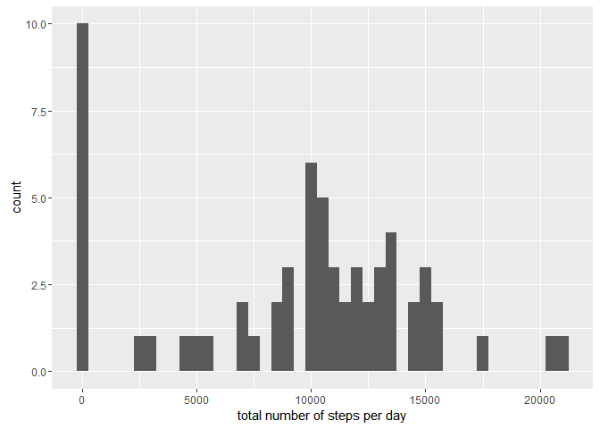
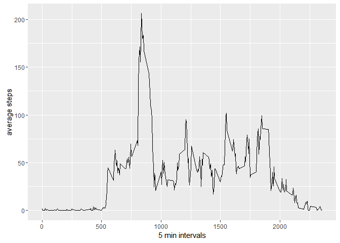
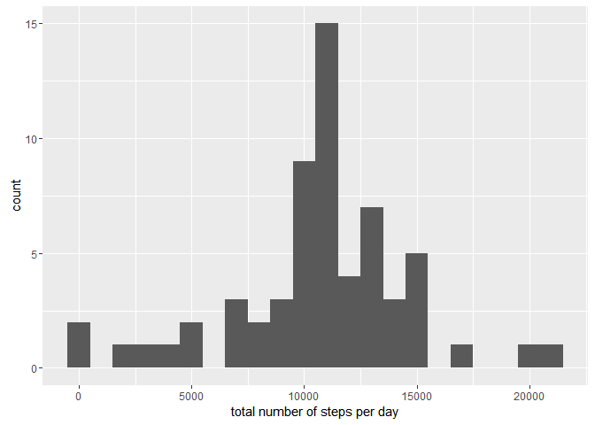
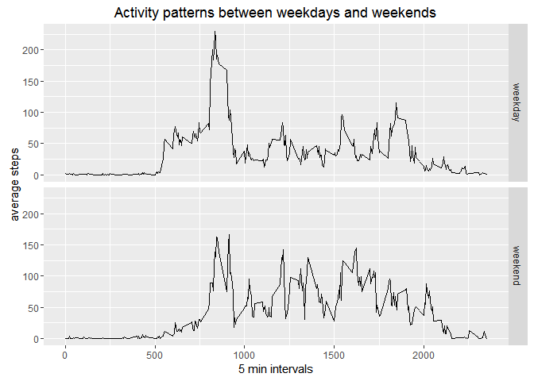

# Reproducible Research: Peer Assessment 1


## Loading and preprocessing the data

```r
library(dplyr)
```

```
## 
## Attaching package: 'dplyr'
```

```
## The following objects are masked from 'package:stats':
## 
##     filter, lag
```

```
## The following objects are masked from 'package:base':
## 
##     intersect, setdiff, setequal, union
```

```r
library(ggplot2)
data<- read.csv('activity.csv')
no_na_data<- tbl_df(data)
data<- tbl_df(data)
no_na_data[is.na(no_na_data)]<- 0
```

## What is mean total number of steps taken per day?

```r
total_step<- no_na_data%>%group_by(date)%>%summarise(sum(steps))
qplot(`sum(steps)`,data = total_step, geom = 'histogram',binwidth=500,xlab = 'total number of steps per day')
```

<!-- -->

```r
mean_total_step<- mean(total_step$'sum(steps)')
median_total_step<- median(total_step$'sum(steps)')
```


## What is the average daily activity pattern?

```r
data<- filter(data,!is.na(steps))
average_step<- data%>%group_by(interval)%>%summarise(mean(steps))
qplot(interval,`mean(steps)`,data = average_step,geom = 'line',xlab = '5 min intervals',ylab = 'average steps')
```

<!-- -->

```r
max_steps<- max(average_step[,'mean(steps)'])
max_ID<- average_step%>%filter(`mean(steps)`==max_steps)%>%select(interval)
```


## Imputing missing values

```r
data<- read.csv('activity.csv')
new_data<- tbl_df(data)
na_data<- filter(new_data,is.na(steps))
na_rows<- nrow(na_data)
for (i in 1:nrow(new_data)){
  if (is.na(new_data[i,"steps"])){
    interval<- as.integer(new_data[i,'interval'])
    position<- average_step[,'interval']==interval
    new_data[i,'steps']<- average_step[position,2]
  }
}
total_step<- new_data%>%group_by(date)%>%summarise(sum(steps))
qplot(`sum(steps)`,data = total_step, geom = 'histogram',binwidth=1000,xlab = 'total number of steps per day')
```

<!-- -->

```r
mean_total_step<- mean(total_step$'sum(steps)')
median_total_step<- median(total_step$'sum(steps)')
```


## Are there differences in activity patterns between weekdays and weekends?

```r
new_data<- mutate(new_data,day= ifelse(weekdays(as.Date(date,'%Y-%m-%d'))%in%c('Saturday','Sunday'),'weekend','weekday'))
new_data<- group_by(new_data,interval,day)
average_step<- new_data%>%summarise(mean(steps))
qplot(interval,`mean(steps)`,data = average_step,geom='line',facets = day~.,xlab = '5 min intervals',ylab = 'average steps',main = 'Activity patterns between weekdays and weekends')
```

<!-- -->
